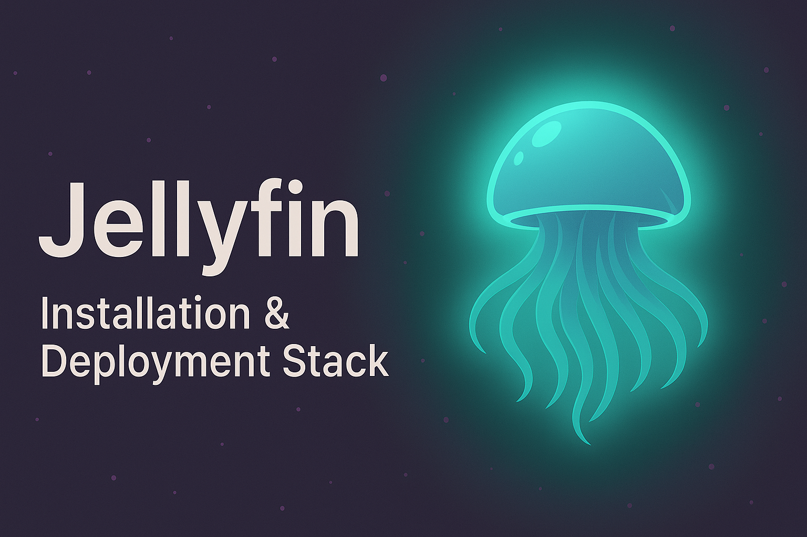
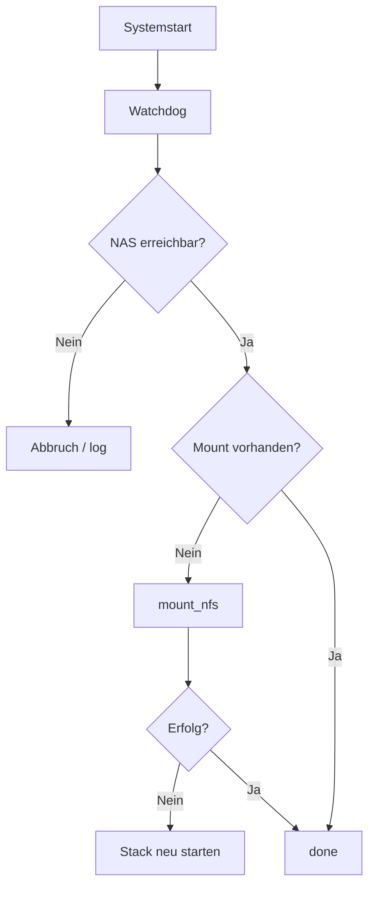

# 📦 Docker Media Stack – NFS Mount + Auto-Watchdog + Monitoring



> 🧪 Medienserver-Setup mit automatisiertem NFS-Mount, Watchdog, Self-Healing & Monitoring – entwickelt für Docker-Umgebungen.

---

## Dienste

| Dienst        | Port    | Zweck                          |
|---------------|---------|-------------------------------|
| `media-server`| 8787    | Medienserver (z. B. Jellyfin) |
| `reverse-proxy`| 80/443 | TLS Reverse Proxy (z. B. Caddy) |
| `metrics`     | 61208   | Systemüberwachung              |
| `status-page` | 3001    | Dienstmonitoring               |

Start:

```bash
./start.sh
```

---

## Deployment-Flow (Mermaid)



---

## Automatisierung

### Crontab

```cron
*/5 * * * * /pfad/zum/watchdog.sh >> /pfad/zum/logs/watchdog.log 2>&1
0 20 * * * /pfad/zum/backup.sh >> /pfad/zum/logs/backup.log 2>&1
0 20 * * 0 /pfad/zum/watchtower.sh >> /pfad/zum/logs/watchtower.log 2>&1
```

### LaunchAgent (macOS)

```bash
~/Library/LaunchAgents/com.stack.mountwatchdog.plist
```

---

## NFS-Mount-Konfiguration

- **Server:** `<nas-hostname>`
- **Export:** `/volume/media`
- **Client-Mountpoint:** `/pfad/zum/mount`

**Optionen:**

```bash
-o resvport,rsize=65536,wsize=65536,async -P
```

---

## Watchdog-Skript

**Pfad:**

```bash
./watchdog.sh
```

**Funktion:**

- Prüft NAS-Verfügbarkeit
- Mountprüfung & -versuch
- Stack-Neustart bei Fehlern

---

## Backup & Updates

- Backup-Skript: `backup.sh`
- Watchtower-Update-Skript: `watchtower.sh`

Log-Ausgaben:

```bash
./logs/backup.log
./logs/watchtower.log
```

---

## Troubleshooting

| Problem              | Lösung                               |
|----------------------|----------------------------------------|
| Medien fehlen        | `mount | grep <mountpoint>`            |
| NAS offline          | `ping <NAS-IP>`                        |
| Server hängt         | `docker restart <container>`          |
| Stack neu starten    | `./start.sh`                           |
| Log prüfen           | `tail -f ./logs/watchdog.log`         |

---

## Projektstruktur

```bash
/media-stack/
├── docker-compose.yml
├── Caddyfile
├── glances.conf
├── status-data/
├── watchdog.sh
├── start.sh
├── logs/
│   └── watchdog.log
├── backup.sh
├── watchtower.sh
├── README.md
```

---

## Lizenz

Dieses Repository ist **privat**.  
Keine Weitergabe oder öffentliche Nutzung vorgesehen.