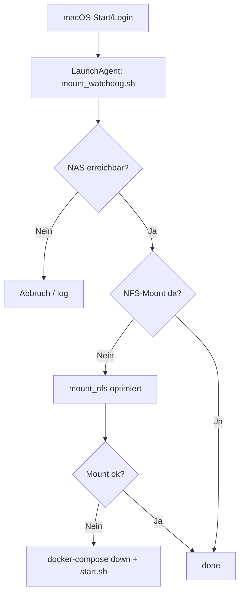

# 🎬 Jellyfin Stack – NFS-Mount + Auto-Watchdog + Monitoring


> 🧪 Privates Medienserver-Setup mit automatisiertem NFS-Mount, Watchdog, Self-Healing & Monitoring – speziell für macOS + Docker!

---

## 📦 Docker-Container

| Dienst        | Port    | Zweck                          |
|---------------|---------|-------------------------------|
| `jellyfin`    | 8787    | Medienserver (Docker)         |
| `caddy`       | 80/443  | TLS Reverse Proxy (`stream.mediaqualle.de`) |
| `glances`     | 61208   | Systemüberwachung              |
| `uptime-kuma` | 3001    | Statusmonitor für Container   |

**Stack-Start:**

```bash
~/docker/start.sh
```

---

## 🧭 Deployment-Flow



---

## ⚙️ Automatisierung

### 🕓 Crontab

```cron
*/5 * * * * /Users/macosserver/docker/mount_watchdog.sh >> /Users/macosserver/docker/logs/watchdog.log 2>&1
0 20 * * * /Users/macosserver/docker/backup_jellyfin_config.sh >> /Users/macosserver/docker/backup.log 2>&1
0 20 * * 0 /Users/macosserver/docker/watchtower.sh >> /Users/macosserver/docker/watchtower.log 2>&1
```

### 🖥 macOS LaunchAgent

```bash
~/Library/LaunchAgents/com.mediaqualle.mountwatchdog.plist
```

→ startet `mount_watchdog.sh` automatisch beim Login

---

## 📂 NFS-Mount

- **NAS:** `akira4800.local` (`10.0.10.245`)
- **Export:** `/volume1/Media`
- **Mountpoint:** `/Users/macosserver/docker_mounts/medien`

**Mount-Optionen (resilient & performant):**

```bash
-o resvport,rsize=65536,wsize=65536,async -P
```

---

## 🛡 Watchdog-Verhalten

**Pfad:**

```bash
~/docker/mount_watchdog.sh
```

**Funktionen:**

- Pingt das NAS
- Prüft NFS-Mount
- Remount-Versuch
- `docker compose down` & Stack-Neustart bei Problem

**Logfile:**

```bash
~/docker/logs/watchdog.log
```

---

## 💾 Backup & Maintenance

- **Tägliches Backup:** `backup_jellyfin_config.sh`
- **Wöchentliche Updates:** `watchtower.sh`

**Logdateien:**

```bash
~/docker/backup.log
~/docker/watchtower.log
```

---

## 🧪 Troubleshooting Quicklist

| Problem              | Lösung                               |
|----------------------|----------------------------------------|
| Medien fehlen        | `mount | grep medien`                  |
| NAS offline          | `ping 10.0.10.245`                     |
| Jellyfin hängt       | `docker restart jellyfin`              |
| Komplett neu starten | `~/docker/start.sh`                   |
| Watchdog-Log prüfen  | `tail -f ~/docker/logs/watchdog.log`  |

---

## 📁 Projektstruktur

```bash
~/docker/
├── jellyfin/
│   ├── docker-compose.yml
│   ├── Caddyfile
│   ├── glances.conf
│   └── uptime-kuma-data/
├── mount_watchdog.sh
├── start.sh
├── logs/
│   └── watchdog.log
├── backup_jellyfin_config.sh
├── watchtower.sh
├── README.md
```

---

## 🔒 Lizenz

Dieses Repository ist **privat**.  
Keine Weitergabe oder öffentliche Nutzung vorgesehen.  
Für Anpassungen oder Hilfe – einfach melden.